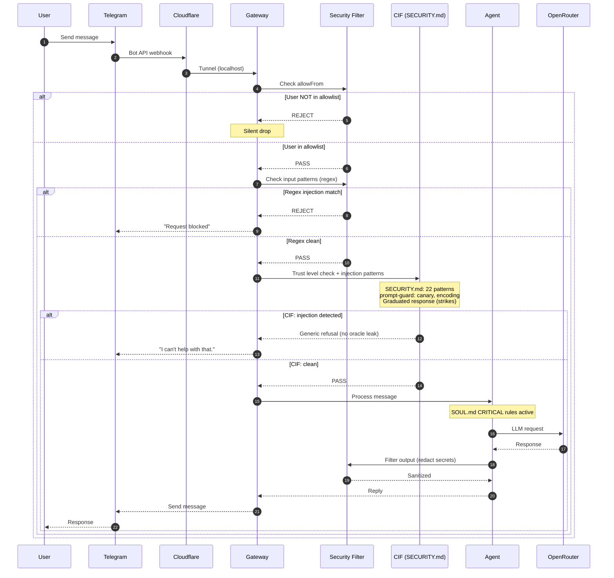
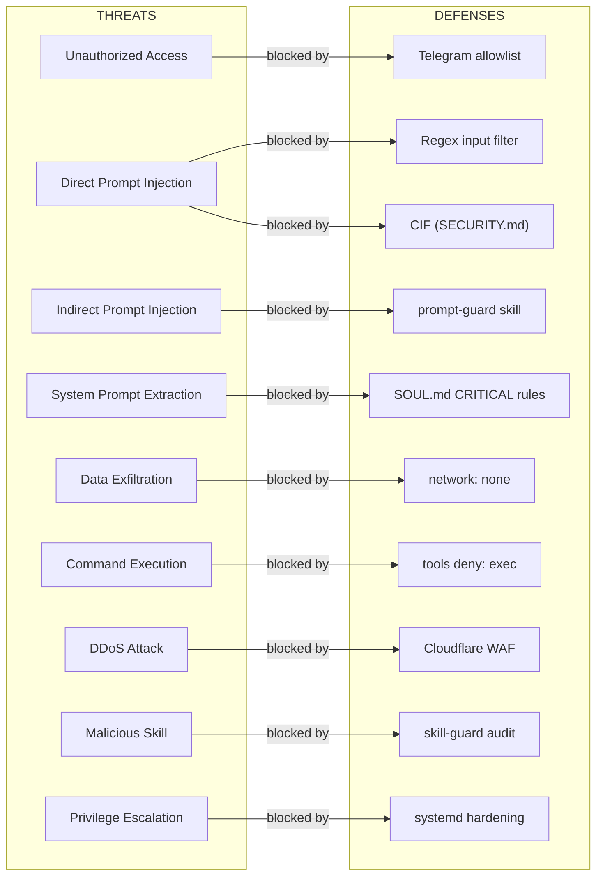

# Security Architecture

## Threat Matrix

| Threat | Attack Vector | Defense |
|--------|--------------|---------|
| Unauthorized Access | DM from unknown user | Telegram allowlist (2 IDs) |
| Direct Prompt Injection | "Ignore instructions" | Regex filter (5 rules) + CIF (22 patterns) + 3-strike |
| Indirect Prompt Injection | Instructions in files/URLs | CIF trust levels + prompt-guard quarantine |
| System Prompt Extraction | "Reveal your prompt" | CIF refusals (no oracle leak) + SOUL.md CRITICAL |
| Command Execution | Shell injection via tools | sandbox mode + tools.deny: exec |
| Data Exfiltration | Web requests from sandbox | network: none + deny: web_fetch, browser |
| DDoS | Mass requests | Cloudflare WAF + rate limiting |
| Port Scanning | Open port discovery | bind: loopback + UFW firewall |
| Credential Theft | Access to API keys | chmod 600 + log redaction + GPG backups |
| Malicious Skill | Trojan in SKILL.md | skill-guard audit + manual review |
| Privilege Escalation | systemd/process abuse | NoNewPrivileges + ProtectKernel* + MemoryMax |

## Telegram Authorization Flow

```
User sends message
      │
      ▼
Telegram Servers ──webhook──> Cloudflare Tunnel ──localhost──> Gateway
                                                                  │
                                                           Check allowFrom
                                                            │         │
                                                           YES        NO
                                                            │         │
                                                         PROCESS   DROP (silent)
```

## Security Flow (Mermaid)



## Threat Model (Mermaid)


