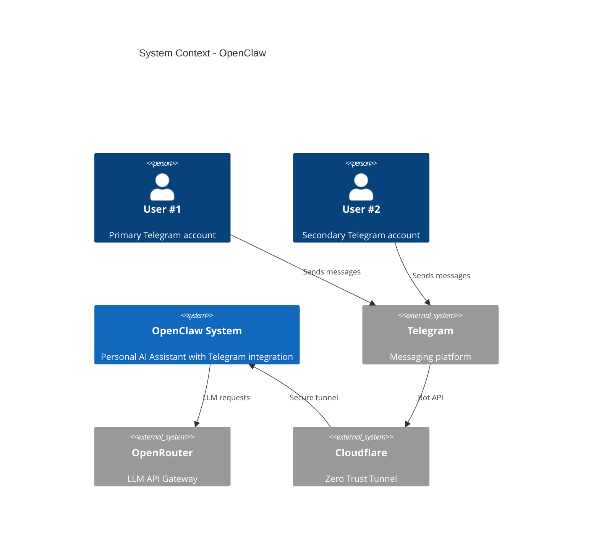
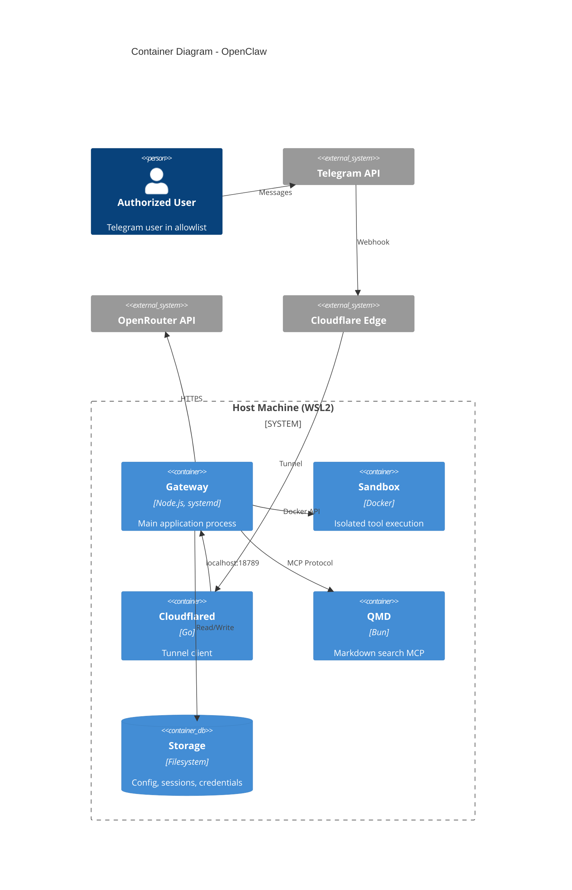

# System Components (C4)

## Level 1: System Context

```
         User #1              User #2
            │                    │
            └───── Telegram ─────┘
                      │
                   Bot API
                      │
              ┌───────▼────────┐
              │  OPENCLAW      │
              │  SYSTEM        │
              │                │
              │  Personal AI   │
              │  Assistant     │
              └──┬──────────┬──┘
                 │          │
          OpenRouter    QMD Search
          (LLM API)    (local docs)
```

## Level 2: Container Diagram

```
┌─────────────────────────────────────────────────────────┐
│                     HOST (WSL2)                          │
│                                                          │
│  ┌────────────────────────────────────────────────────┐ │
│  │              GATEWAY (systemd service)              │ │
│  │              Node.js :18789 (loopback)              │ │
│  │                                                     │ │
│  │  Telegram    WebChat     Gateway    Security        │ │
│  │  Channel     Server      Core       Filter          │ │
│  │  (grammY)    (WS)        (Auth)     (Input/Output)  │ │
│  │                                                     │ │
│  │  Agent       Tools       LLM        Output          │ │
│  │  Runtime     Manager     Provider   Processor       │ │
│  │  (Sessions)  (Sandbox)   (OR API)   (Redaction)     │ │
│  └────────────────────┬───────────────────────────────┘ │
│                       │                                  │
│  ┌────────────────────▼───────────────────────────────┐ │
│  │           SANDBOX CONTAINER(S)                      │ │
│  │           Ephemeral, per-session                    │ │
│  │                                                     │ │
│  │  - Isolated /workspace (read-only)                  │ │
│  │  - No network access                                │ │
│  │  - Limited tools (deny: exec, write, browser)       │ │
│  │  - Resource limits (256MB, 0.5 CPU, 32 PIDs)        │ │
│  └─────────────────────────────────────────────────────┘ │
│                                                          │
│  ┌──────────────────┐  ┌──────────────────┐             │
│  │   cloudflared    │  │   QMD (MCP)      │             │
│  │   Zero Trust     │  │   Bun server     │             │
│  │   No open ports  │  │   MD search      │             │
│  └──────────────────┘  └──────────────────┘             │
│                                                          │
│  ┌──────────────────────────────────────────────────┐   │
│  │              PERSISTENT STORAGE                    │   │
│  │  ~/.openclaw/                                     │   │
│  │  ├── openclaw.json       # Config                 │   │
│  │  ├── workspace/          # SECURITY.md, SOUL.md   │   │
│  │  │   └── .openclaw/skills/ # prompt/skill-guard   │   │
│  │  ├── credentials/        # Secrets (chmod 600)    │   │
│  │  ├── backups/            # GPG AES-256            │   │
│  │  └── agents/             # Sessions & state       │   │
│  └──────────────────────────────────────────────────┘   │
└──────────────────────────────────────────────────────────┘
```

## C4 Mermaid Diagrams




