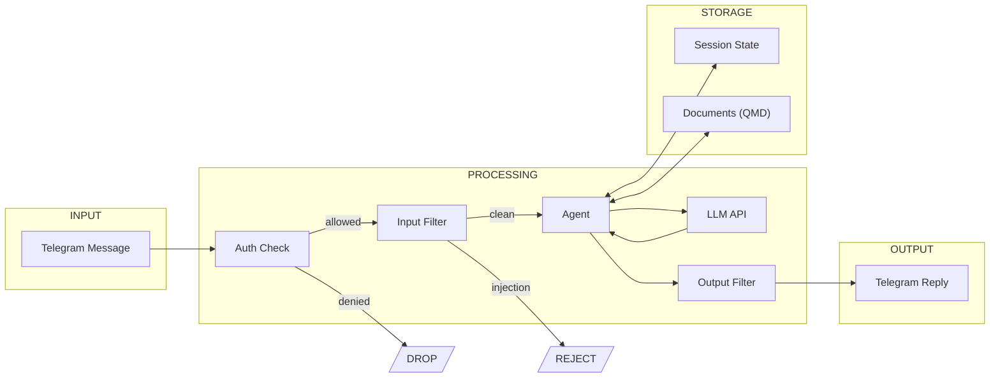
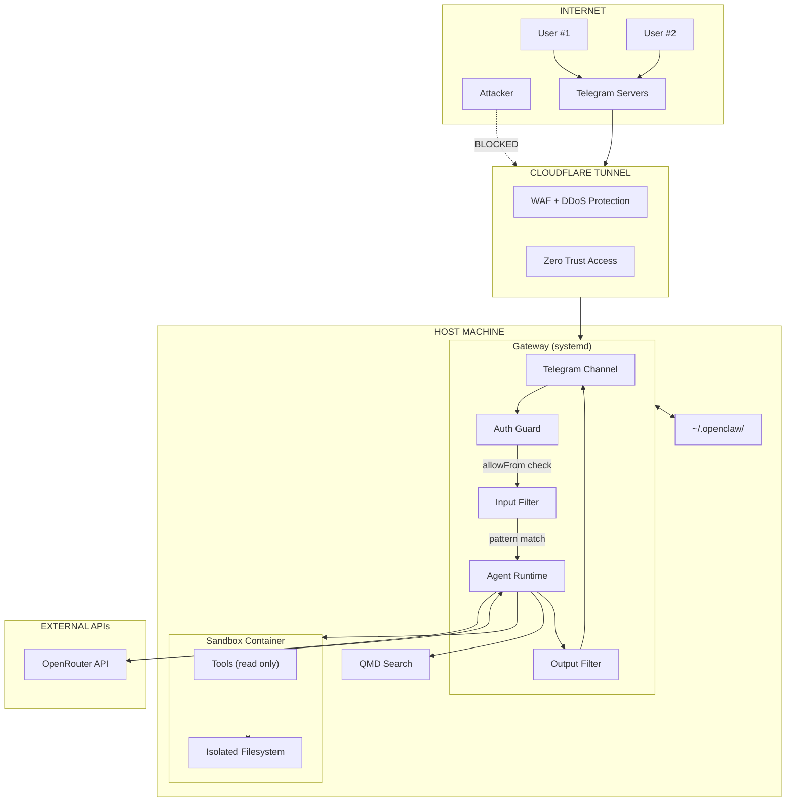
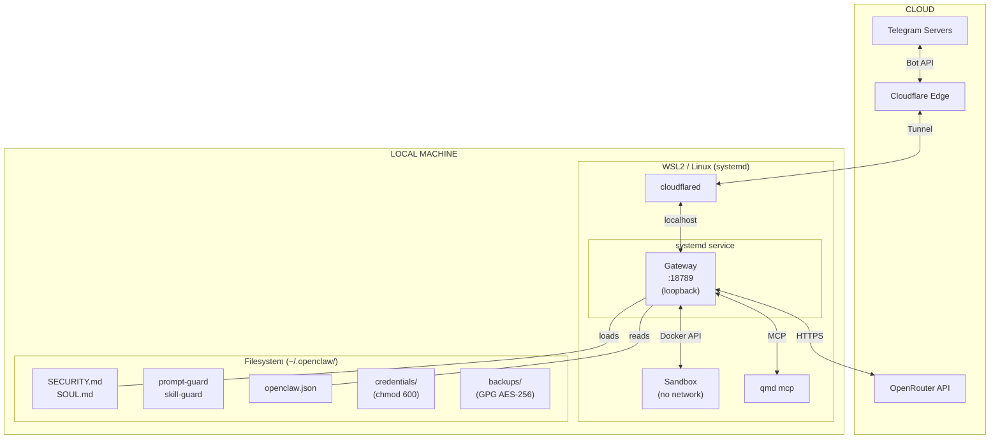

# Data Flow & Deployment

## Message Processing Flow

```mermaid
flowchart LR
    subgraph Input["INPUT"]
        TG_IN["Telegram Message"]
    end

    subgraph Processing["PROCESSING"]
        AUTH["Auth Check"]
        FILTER["Input Filter"]
        AGENT["Agent"]
        LLM["LLM API"]
        OUT["Output Filter"]
    end

    subgraph Output["OUTPUT"]
        TG_OUT["Telegram Reply"]
    end

    subgraph Storage["STORAGE"]
        SESSION["Session State"]
        DOCS["Documents (QMD)"]
    end

    TG_IN --> AUTH
    AUTH -->|allowed| FILTER
    AUTH -->|denied| X1[/"DROP"/]

    FILTER -->|clean| AGENT
    FILTER -->|injection| X2[/"REJECT"/]

    AGENT <--> SESSION
    AGENT <--> DOCS
    AGENT --> LLM
    LLM --> AGENT
    AGENT --> OUT
    OUT --> TG_OUT
```

## Security Layers Flow

```mermaid
flowchart TB
    subgraph Internet["INTERNET"]
        User1["User #1"]
        User2["User #2"]
        Attacker["Attacker"]
        TG["Telegram Servers"]
    end

    subgraph CF["CLOUDFLARE TUNNEL"]
        WAF["WAF + DDoS Protection"]
        ZT["Zero Trust Access"]
    end

    subgraph Host["HOST MACHINE"]
        subgraph GW["Gateway (systemd)"]
            TGChannel["Telegram Channel"]
            Auth["Auth Guard"]
            InputFilter["Input Filter"]
            Agent["Agent Runtime"]
            OutputFilter["Output Filter"]
        end

        subgraph SB["Sandbox Container"]
            Tools["Tools (read only)"]
            FS["Isolated Filesystem"]
        end

        QMD["QMD Search"]
        Storage["~/.openclaw/"]
    end

    subgraph External["EXTERNAL APIs"]
        OR["OpenRouter API"]
    end

    User1 --> TG
    User2 --> TG
    Attacker -.->|BLOCKED| CF

    TG --> CF
    CF --> GW

    TGChannel --> Auth
    Auth -->|"allowFrom check"| InputFilter
    InputFilter -->|"pattern match"| Agent
    Agent --> SB
    Agent --> QMD
    Agent --> OR
    OR --> Agent
    Agent --> OutputFilter
    OutputFilter --> TGChannel

    GW <--> Storage
    SB <--> FS
```

## Deployment Architecture

```mermaid
flowchart TB
    subgraph Cloud["CLOUD"]
        CF["Cloudflare Edge"]
        TG["Telegram Servers"]
        OR["OpenRouter API"]
    end

    subgraph Local["LOCAL MACHINE"]
        subgraph WSL["WSL2 / Linux (systemd)"]
            subgraph Systemd["systemd service"]
                GW["Gateway\n:18789\n(loopback)"]
            end
            SB["Sandbox\n(no network)"]
            CFD["cloudflared"]
            QMD["qmd mcp"]
        end

        subgraph FS["Filesystem (~/.openclaw/)"]
            SEC["SECURITY.md\nSOUL.md"]
            SKILLS["prompt-guard\nskill-guard"]
            CONFIG["openclaw.json"]
            CREDS["credentials/\n(chmod 600)"]
            BACKUPS["backups/\n(GPG AES-256)"]
        end
    end

    TG <-->|"Bot API"| CF
    CF <-->|"Tunnel"| CFD
    CFD <-->|"localhost"| GW
    GW <-->|"Docker API"| SB
    GW <-->|"MCP"| QMD
    GW <-->|"HTTPS"| OR

    GW ---|"reads"| CONFIG
    GW ---|"loads"| SEC
```
