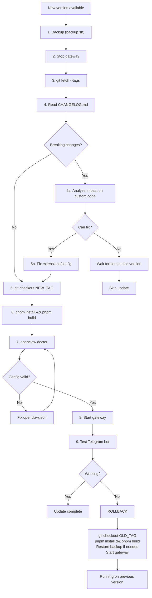

# Update Strategy

Safe update process for OpenClaw with custom integrations.

**Current version:** OpenClaw 2026.2.1
**Last updated:** 2026-02-03

---

## What Can Break on Update

| Component | Risk | Cause | Our custom files |
|-----------|------|-------|------------------|
| Custom extensions | HIGH | Plugin API change (v1 → v2), event names, config keys | `bookmarks/`, `telegram-digest/`, `voice-transcriber/`, `task-manager/` |
| openclaw.json | MEDIUM | New required fields, removed options, schema validation | `~/.openclaw/openclaw.json` |
| Python scripts | LOW | Only break if OS deps change | `telegram-digest.py`, `daily-digest.sh` |
| Custom skills | LOW | SKILL.md format change | `workspace/skills/` |
| SECURITY.md / SOUL.md | NONE | Plain text, loaded as-is | `workspace/SECURITY.md`, `workspace/SOUL.md` |
| Credentials | NONE | Separate directory, not touched | `credentials/.env`, `credentials/telethon.session` |
| Cron jobs | NONE | Independent, call scripts directly | `crontab -l` |

## Known Pitfalls (Learned the Hard Way)

| Issue | Version | What happened |
|-------|---------|---------------|
| `configSchema` mandatory | 2026.2.x | Plugins without `configSchema` in manifest silently fail |
| `gateway.mode` required | 2026.2.x | Gateway won't start without `gateway.mode: "local"` |
| Invalid config keys rejected | 2026.2.1 | Keys like `identity`, `autoCompact`, `security`, `mcp`, `webchat` at wrong level cause startup failure |
| Plugin event names | 2026.2.x | Events use underscores (`message_received`), not colons (`message:received`) |
| `registerTool` scope | 2026.2.x | `api.registerTool()` registers gateway-level tools, NOT agent LLM tools. Use `api.on("message_received")` event hooks for message handling |
| `agents.defaults.load` | 2026.2.1 | `load` is not a valid key under `agents.defaults` — rejected by config validation |
| Free model IDs rotate | ongoing | OpenRouter `:free` model IDs change; `gemini-*:free`, `llama-*:free`, `mistral-*:free` removed early 2026. Use `stepfun/step-3.5-flash:free` |
| Google free tier limit | ongoing | `GOOGLE_API_KEY` free tier = 20 requests/day, exhausts fast |
| OpenRouter provider registration | 2026.2.1 | OpenClaw doesn't know OpenRouter by default — add `models.providers.openrouter` with `baseUrl` and `api: "openai-completions"` |
| `openai-responses` vs `openai-completions` | 2026.2.1 | OpenRouter uses `/v1/chat/completions` only. `api: "openai-responses"` sends to `/v1/responses` → 404 |
| Model ID `:free` suffix required | ongoing | OpenRouter returns 404 for `stepfun/step-3.5-flash` without `:free` suffix |
| Plugin message object | 2026.2.x | Message fields: `msg.content` (text), `msg.metadata.threadId` (topic), `msg.metadata.to` (chat ID as `telegram:-100xxx`). NOT `msg.text`, `msg.message_thread_id`, `msg.chat.id` |
| OpenRouter free tier 50/day | ongoing | Without $10 credits, OpenRouter limits to 50 free requests/day |

## Plugin API Reference

Valid `PluginHookName` events (from `types.d.ts`):

```
before_agent_start | agent_end
before_compaction  | after_compaction
message_received   | message_sending  | message_sent
before_tool_call   | after_tool_call  | tool_result_persist
session_start      | session_end
gateway_start      | gateway_stop
```

Valid `OpenClawPluginApi` methods:

```
registerTool       — gateway-level tool (NOT visible to LLM agent)
registerHook       — lifecycle hook handler
registerHttpHandler / registerHttpRoute
registerChannel    — custom messaging channel
registerCommand    — bypass LLM, handle command directly
registerService    — background service
registerProvider   — model provider
registerCli        — CLI subcommands
on(hookName, handler) — shorthand for registerHook
```

## Current Model Configuration

```json
{
  "primary": "google/gemini-2.5-flash",
  "fallbacks": [
    "openrouter/stepfun/step-3.5-flash:free"
  ]
}
```

Failover: Google 429 → StepFun Step 3.5 Flash via OpenRouter (MoE 196B, 256K context, tool calling support).

## Update Flow



## Pre-Update Checklist

```
[ ] Read CHANGELOG.md for new version
[ ] Check Plugin API version — look for PluginHookName changes in types.d.ts
[ ] Check if event names changed (message_received, etc.)
[ ] Search for deprecation warnings in current logs
[ ] Run backup: ~/.openclaw/scripts/maintenance/backup.sh
[ ] Note current version: cd ~/openclaw && git describe --tags
[ ] Verify fallback model IDs still valid on OpenRouter
```

## Custom Integration Compatibility Check

Before updating, verify your integrations against the new version:

```bash
# 1. Save current state
cd ~/openclaw
OLD_TAG=$(git describe --tags)

# 2. Checkout new version in temp branch (don't affect running system)
git fetch --tags
NEW_TAG=$(git tag --sort=-v:refname | head -1)

# 3. Check CHANGELOG for breaking changes
git log $OLD_TAG..$NEW_TAG --oneline
git diff $OLD_TAG..$NEW_TAG -- CHANGELOG.md

# 4. Check if Plugin API interface changed
git diff $OLD_TAG..$NEW_TAG -- dist/plugins/types.d.ts
git diff $OLD_TAG..$NEW_TAG -- dist/plugin-sdk/

# 5. Check if config schema changed
git diff $OLD_TAG..$NEW_TAG -- dist/config/

# 6. Check event hook names
grep "PluginHookName" dist/plugins/types.d.ts
```

## What to Check After Update

| Check | Command | Expected |
|-------|---------|----------|
| Gateway starts | `tmux send-keys -t gw ...` or `systemctl status openclaw` | active (running) |
| Config valid | `openclaw doctor` | No errors, Plugins: Loaded: 6 |
| Model working | Check gw.log for `agent model:` | `google/gemini-2.5-flash` |
| Custom plugins loaded | `grep "Plugin loaded" /tmp/gw.log` | All 4 plugins |
| Event hooks registered | `grep "hooks registered" /tmp/gw.log` | bookmarks, telegram-digest, voice-transcriber |
| Telegram bot responds | Send test message in General topic | Response received |
| Bookmarks work | Send URL to Bookmarks topic | "Saving bookmark..." reply |
| Voice transcription | Send voice to Voice topic | Transcription appears |
| Cron jobs intact | `crontab -l` | Daily digest, security monitor |

## Rollback Procedure

If the update breaks something:

```bash
# 1. Stop gateway
tmux send-keys -t gw C-c
# or: sudo systemctl stop openclaw

# 2. Rollback to previous version
cd ~/openclaw
git checkout $OLD_TAG

# 3. Rebuild
pnpm install --frozen-lockfile
pnpm build

# 4. Restore config if needed
cp ~/.openclaw/openclaw.json.bak ~/.openclaw/openclaw.json

# 5. Start
tmux send-keys -t gw 'cd ~/openclaw && set -a && . ~/.openclaw/credentials/.env && set +a && node openclaw.mjs gateway 2>&1 | tee /tmp/gw.log' Enter
```

## Safe Zones (Never Touched by Updates)

```
~/.openclaw/                       ← YOUR data, git pull never touches this
├── openclaw.json                  ← Your config (may need manual migration)
├── credentials/
│   ├── .env                       ← API keys (chmod 600)
│   └── telethon.session           ← Telegram userbot session
├── workspace/
│   ├── SECURITY.md                ← Cognitive Integrity Framework
│   ├── SOUL.md                    ← Agent identity + rules
│   ├── MEMORY.md                  ← Agent memory
│   ├── topics/                    ← All topic data
│   │   ├── bookmarks/BOOKMARKS.json
│   │   ├── channel-digest/
│   │   ├── voice/transcripts/
│   │   └── ...
│   ├── skills/                    ← Custom skills (prompt-guard, skill-guard)
│   └── .openclaw/
│       └── extensions/            ← Custom plugins
│           ├── bookmarks/
│           ├── telegram-digest/
│           ├── task-manager/
│           └── voice-transcriber/
├── scripts/                       ← Custom scripts
│   ├── digest/                   ← Channel digest scripts + config
│   ├── notify/                   ← Notification scripts
│   ├── maintenance/              ← System maintenance scripts
│   └── tools/                    ← Standalone utilities
├── backups/                       ← Encrypted backups
└── logs/                          ← Logs

~/openclaw/                        ← UPSTREAM, replaced on git pull
├── dist/                          ← Rebuilt on update
├── extensions/                    ← Official plugins, replaced
├── skills/                        ← Official skills, replaced
└── src/                           ← Source, replaced
```

## Config Migration Pattern

When `openclaw.json` schema changes:

```bash
# 1. Backup current config
cp ~/.openclaw/openclaw.json ~/.openclaw/openclaw.json.bak

# 2. Run doctor to see what changed
openclaw doctor

# 3. Fix reported issues
# Doctor reports: missing fields, deprecated options, unrecognized keys

# 4. Common fixes for 2026.2.x:
# - Add: "gateway": { "mode": "local" }
# - Add configSchema to all plugin manifests
# - Remove invalid keys (identity, autoCompact at top level, etc.)
# - Fix event names: message:received → message_received

# 5. Verify
openclaw doctor  # should pass
```

## Version Compatibility

| OpenClaw | Plugin API | Config changes | Event names |
|----------|-----------|----------------|-------------|
| 2026.1.x | v1 | `configSchema` optional | `message:received` (colon) |
| 2026.2.x | v1 | `configSchema` required, `gateway.mode` required | `message_received` (underscore) |
| 2026.3.x | v2 (planned) | TBD | TBD |

## Version Pinning

To avoid surprise updates, pin to exact version:

```bash
# Update to specific version (not latest)
cd ~/openclaw
git checkout v2026.2.1    # exact tag, not branch

# Check available versions
git tag --sort=-v:refname | head -10
```
